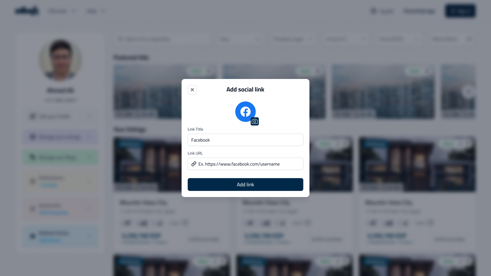
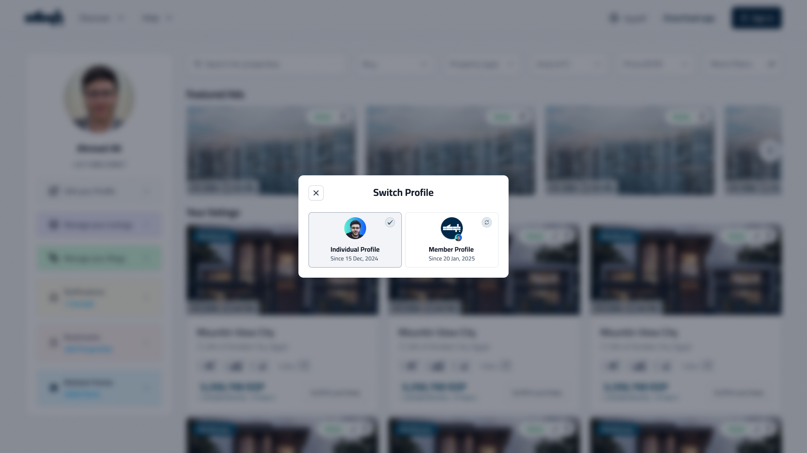
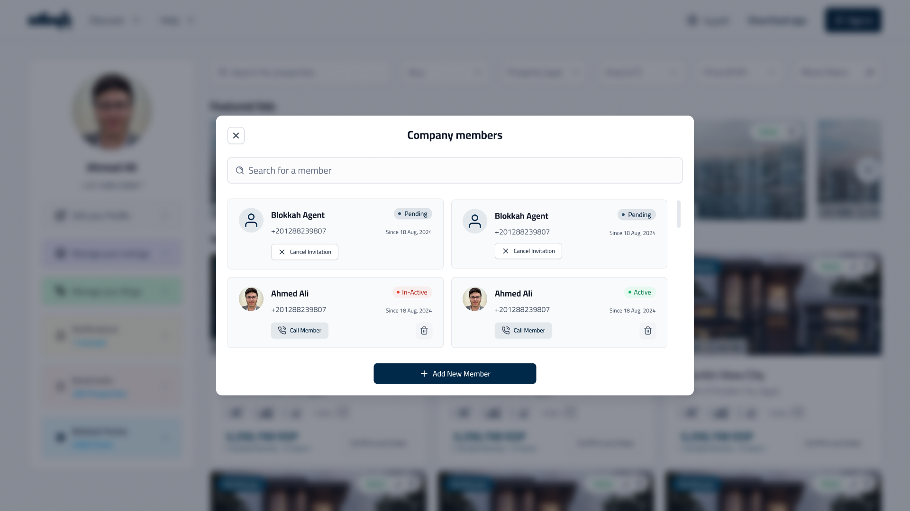
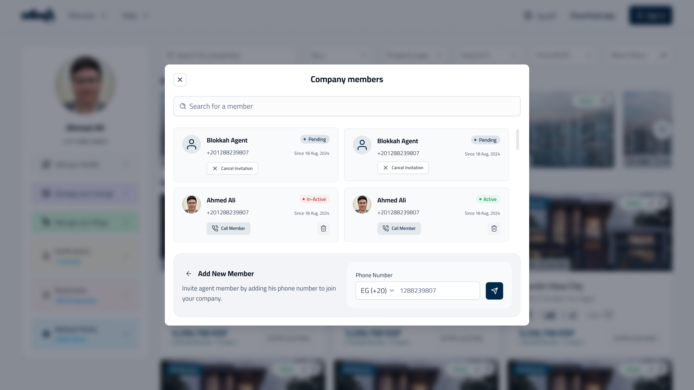
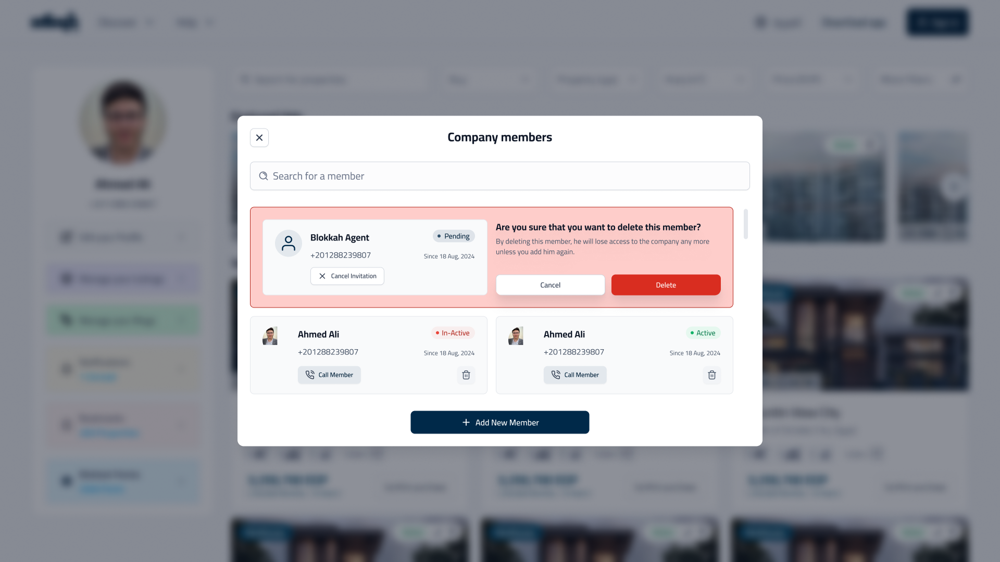
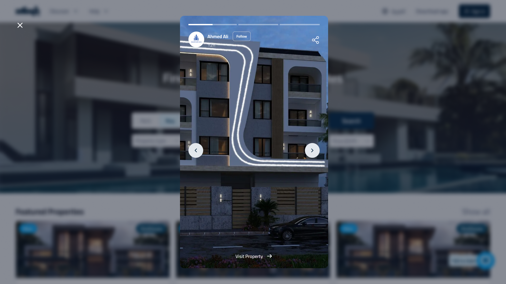

# Blokkah Frontend Showcase

Welcome to **Blokkah**, a platform designed to help users easily find the best properties. This repository showcases the responsive and user-friendly frontend of the app, developed using modern web technologies.

## 📸 Screenshots

    
    
    
    
    
    
    
    
    
    
    
    
    
    
    
    
    
    
    
    
    
    
    
    
    
    
    
    
    
    
    
    
    
    

## 🛠 Tech Stack

-   **Framework**: [Next.js]
-   **UI**: [Tailwind CSS]

## 👨‍💻 My Role

As the web developer, I implemented the UI/UX designs, ensuring a smooth, responsive, and accessible experience for all users.

## 📬 Contact

Feel free to reach out to me for any feedback or collaboration:

-   **Email**: eng.abdelrahman.sharaf@gmail.com
-   **LinkedIn**: [Your LinkedIn](https://linkedin.com/in/eng-abdelrahman-sharaf/)
